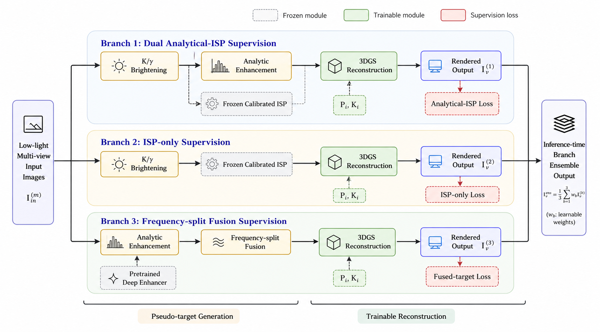

# 3DGS4LL: Multi-Branch Low-Light 3D Gaussian Splatting

### 2nd Place — NTIRE 2026 Challenge on 3D Low-Light Enhancement (CVPR Workshop)

<p align="center">
  
</p>

> **3DGS4LL: Multi-Branch Low-Light 3D Gaussian Splatting with Calibrated ISP
> Supervision and Frequency-Split Pseudo-Target Fusion**
>
> Seho Ahn<sup>*</sup>, Donggun Kim, Il-Youp Kwak<sup>†</sup>, Seungsang Oh<sup>†</sup>
>
> *All methods, code, and experiments developed by Seho Ahn.*
>
> <sup>*</sup> First author &nbsp;&nbsp;&nbsp; <sup>†</sup> Co-corresponding authors

## Highlights

- Bright-space pseudo-target supervision for low-light 3DGS
- Two complementary branches: analytical dual-loss + frequency-split fusion
- Calibrated ISP prior (63 parameters from a single validation scene)
- SH degree 2 regularization to prevent noise overfitting
- **2nd place** in NTIRE 2026 3DRR Track 1 (3D Low-Light Enhancement)

## Results

### Quantitative Results on RealX3D Benchmark (7-scene dev+test average)

| Method | PSNR ↑ | SSIM ↑ | LPIPS ↓ |
|--------|--------|--------|---------|
| Naive 3DGS (dark input) | 6.61 | 0.058 | 0.659 |
| RetinexFormer → 3DGS | 12.65 | — | — |
| **3DGS4LL — Branch 1 single (this repo)** | **21.96** | **0.722** | — |
| **3DGS4LL — Branch 3 single (this repo)** | **21.93** | **0.748** | — |
| 3DGS4LL — 2-branch average (this repo) | 22.51 | 0.765 | — |
| 3DGS4LL — 5-model ensemble (competition) | 22.76 | 0.777 | — |

## Installation

```bash
git clone https://github.com/dfgcc534/3DGS4LL.git
cd 3DGS4LL
pip install -r requirements.txt
```

### Dependencies
- Python >= 3.8
- PyTorch >= 2.0
- gsplat
- RetinexFormer (for Branch 3 preprocessing, auto-downloaded)

## Dataset

We use the [RealX3D](https://huggingface.co/datasets/ToferFish/RealX3D) dataset from the NTIRE 2026 3DRR Challenge.
Download from HuggingFace and place under `data/`.

```
data/
├── validation/
│   └── BlueHawaii/
│       ├── train/                # Low-light input images (R=40)
│       ├── test/                 # Test views (poses + GT images)
│       ├── transforms_train.json
│       └── transforms_test.json
├── development/
│   ├── Chocolate/                # Same structure as above
│   ├── Cupcake/
│   ├── GearWorks/
│   └── Laboratory/
└── test/
    ├── MilkCookie/
    ├── Popcorn/
    └── Ujikintoki/
```

## Usage

### 1. Preprocessing (Optional — for visualization/debugging)

Note: The training scripts apply enhancement **on-the-fly**, so preprocessing
is not required before training. These standalone scripts are provided for
inspecting pseudo-targets.

```bash
# Analytical brightening (K/gamma/WB/denoise)
python preprocessing/analytical_brighten.py \
    --data_dir data/development/Chocolate \
    --K 2.75 --gamma 2.25 \
    --wb_gains 1.2 1.0 1.05 --denoise_sigma 1.0

# Calibrated ISP pseudo-target (for Branch 1 dual loss)
python preprocessing/calibrated_isp.py \
    --data_dir data/development/Chocolate \
    --params pretrained/calibrated_isp.pt --K 2.75 --gamma 2.25

# Frequency-split fusion pseudo-target (for Branch 3)
python preprocessing/freq_split_fusion.py \
    --data_dir data/development/Chocolate \
    --isp_params pretrained/calibrated_isp.pt \
    --detail_gain 2.0 --freq_kernel 3
```

### 2. Training

```bash
# Branch 1: Analytical dual-loss
bash scripts/train_branch1.sh Chocolate dev

# Branch 3: Frequency-split fusion (recommended)
bash scripts/train_branch3.sh Chocolate dev
```

### 3. Rendering & Evaluation

```bash
# Render novel views
python render.py --config configs/branch3_freq_split.yaml \
                 --checkpoint outputs/branch3_dev/Chocolate/.../latest.pt

# Evaluate (requires GT images)
python evaluate.py --pred_dir outputs/branch3_dev/Chocolate/.../test \
                   --gt_dir data/dev/Chocolate/test --save
```

## Method Overview

Our framework optimizes a bright-space 3D Gaussian scene representation
from severely degraded multi-view observations (R=40 exposure reduction).

**Two complementary branches:**

| Branch | Pseudo-Target | Key Idea |
|--------|---------------|----------|
| Branch 1 | Analytical + ISP dual loss | Stable color from analytical model + structure from calibrated ISP |
| Branch 3 | Frequency-split fusion | Analytical low-freq (color/brightness) + RetinexFormer high-freq (detail) |

**Key design choices:**
- **Calibrated ISP** (63 params): Suppresses structured chromatic noise via a lightweight camera pipeline prior, calibrated from a single validation scene
- **SH degree 2**: Limits angular color bandwidth to prevent noise overfitting with limited training views (~20-30 per scene)
- **Random initialization**: Replaces COLMAP sparse points, which are unreliable under extreme low-light

For full details, please refer to [docs/METHODOLOGY.md](docs/METHODOLOGY.md).

## Note on Differences from Competition Submission

The competition submission used three branches (including an ISP-only branch)
with a 5-model weighted ensemble. In post-competition experiments, we found that
the ISP-only branch does not improve performance in the two-branch configuration
and the ensemble is not necessary to achieve strong results. This repository
provides the streamlined two-branch version, which we recommend as the default.

## External Models / Data

- **CalibratedISP**: Camera ISP model calibrated on RealX3D validation GT (included in `pretrained/`)
- **RetinexFormer** (LOL_v1): Pre-trained low-light enhancement model (auto-downloaded from GitHub)
  - Paper: Cai et al., "Retinexformer: One-stage Retinex-based Transformer for Low-light Image Enhancement", ICCV 2023

## Author Contributions

**Seho Ahn** (first author) conceived the method, implemented the entire codebase in
this repository, and conducted all experiments and evaluations for the NTIRE 2026 3DRR
Challenge submission.

**Donggun Kim** (second author) contributed to research discussions.

**Il-Youp Kwak** and **Seungsang Oh** (co-corresponding authors) provided advisory
support and research supervision.

## Acknowledgements

- [gsplat](https://github.com/nerfstudio-project/gsplat) — 3DGS implementation
- [RetinexFormer](https://github.com/caiyuanhao1998/Retinexformer) — Pretrained low-light enhancement
- [RealX3D](https://huggingface.co/datasets/ToferFish/RealX3D) — NTIRE 2026 3DRR Challenge dataset

## License

This project is licensed under the MIT License - see the [LICENSE](LICENSE) file for details.
